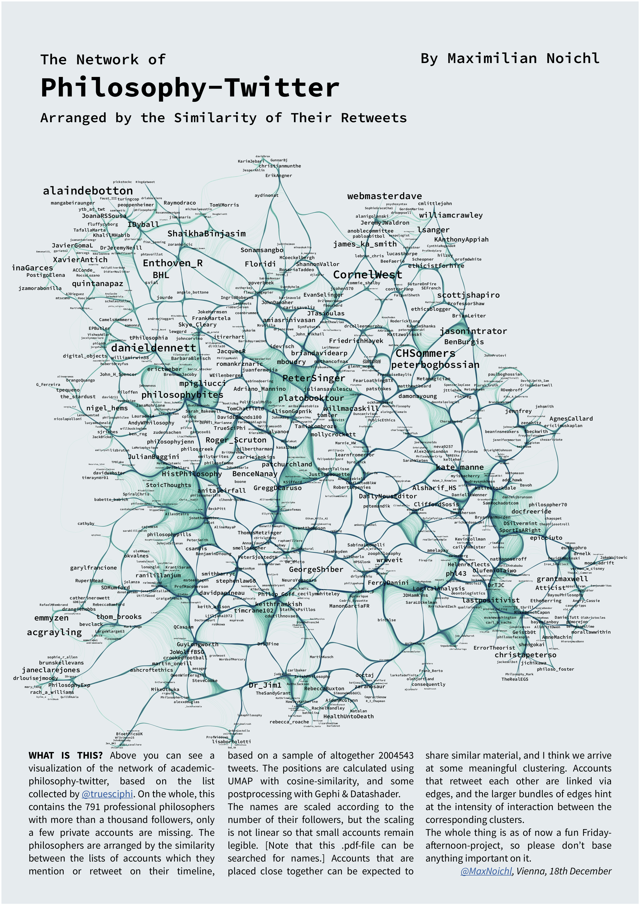

# A Map of Twitter accounts by philosophers

The code in this repo produces the following map of philosophy-twitter:

It consists of two jupyter notebooks. The first one, `get_tweets`, can be used download ~2000000 tweets of philosophers (or if you have another list in mind, you can download that.) It then collects the metadata for each of the accounts, and adds to each a list of the accounts that have been mentioned on this accounts timeline. This metadata then gets saved, and is available as a pickled `pandas`-dataframe under `tweeter_data.p`.

I'm not putting up the basic dataset right now, because it's pretty large. If the metadata doesn't suffice for your purposes, maybe drop me a line, and we can figure sth. out. (Or collect the data yourself, it shouldn't be hard to get it up and running.) 

The second notebook `building_the_network.ipynb` generates the elements of the network-graphic from `tweeter_data.p`, and contains some notes on how to put everything together. 

If you spot any errors in the code, or have improvements, I would appreciate pull requests. Also, if you want to do a map like this, I'm very much open to collaborations. If you would like to do one on your own, that's of course fine as well.

Below are some additions one could look into, in order to expand this project. I don't know if/when I will get to them, so if you find one of them interesting, go for it! Also, feel free to add your own!

## Additions:

 * Expand the dataset. A lot of people were legitimately dismayed because they couldn't find themselves included. One improvement that could be made here might be to iteratively expand the list of accounts outwards, maybe by looking for accounts that reach a certain proportion of within-sample to out-sample follows. 
 * Do some cluster analysis. I recommend Leiden-clustering on the simplical sets. The clusters could be labeled by extracting words from the tweets. [Careful here: in my experience, people often don't like being labled.]
 * It has been pointed out to me that one could differentiate between quote tweets with or without comments. (Maybe simply by adding a little suffix to one type, so that they become distinc features for the dimensionality-reduction.)
 * Do some network analysis. So far I only run HITS in one of the notebooks, but there is so much more that one could do with this. 
 * Link up with citations. It would be interesting to see, whether soc. media interacts with citation-counts in philosphy. 
